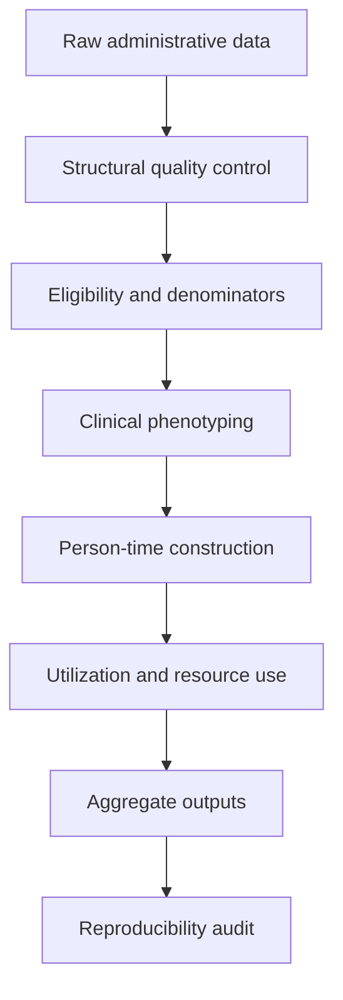
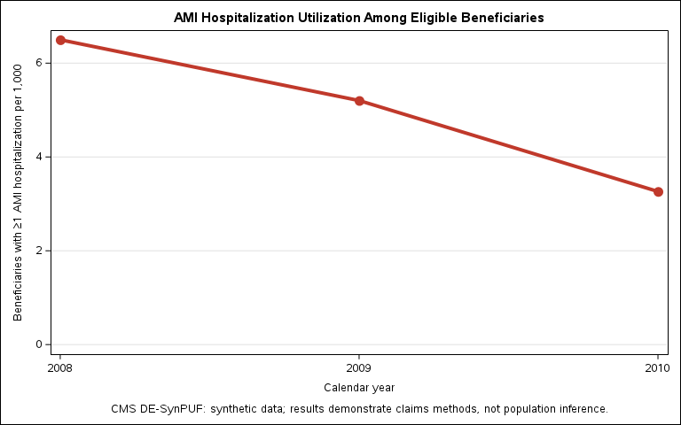
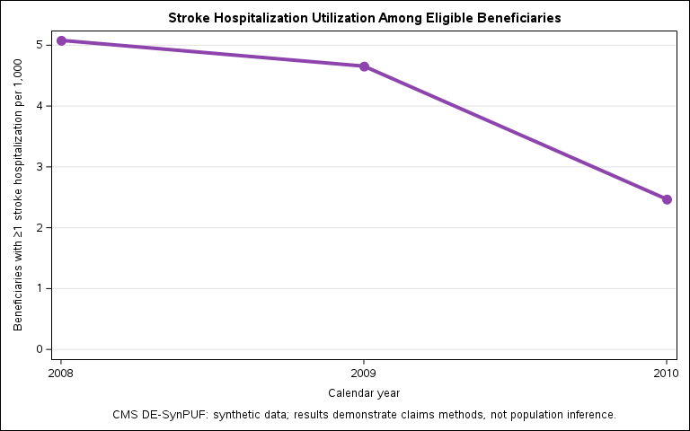
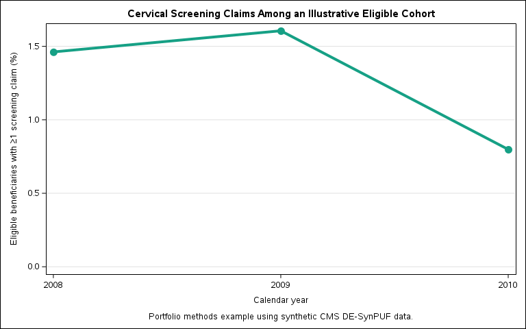
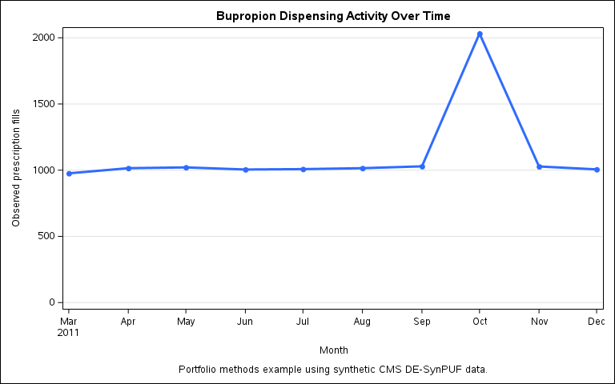
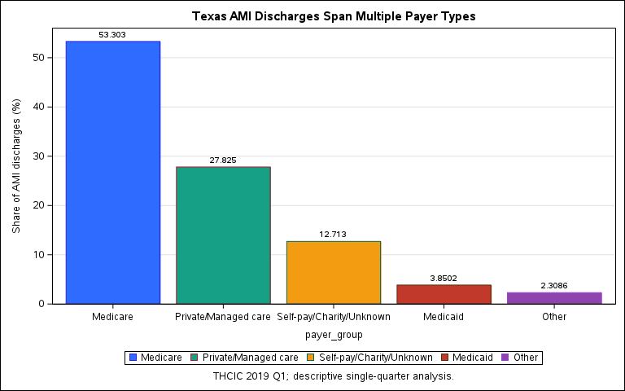

# Claims to Cohorts

### From Administrative Healthcare Data to Reproducible Analytic Cohorts in SAS

**A reproducible healthcare claims analytics framework for epidemiology, real-world evidence (RWE), health economics and outcomes research (HEOR), pharmacoepidemiology, and health-services research.**

## 30-Second Summary

| Element                    | Summary                                                                                                                                                                                                                    |
| -------------------------- | -------------------------------------------------------------------------------------------------------------------------------------------------------------------------------------------------------------------------- |
| **Problem**                | Administrative healthcare data must be converted into correctly defined populations, exposures, clinical events, and denominators before they can support credible real-world evidence.                                    |
| **Data**                   | Six enrollment, inpatient, professional, pharmacy, hospital-discharge, and facility datasets containing 1,813,866 source records.                                                                                          |
| **Methods**                | SAS-based quality control, eligibility construction, claims phenotyping, person-time transformation, medication-exposure construction, utilization analysis, resource-use analysis, and ICD-9/ICD-10 phenotype adaptation. |
| **Principal Contribution** | Demonstrates a denominator-first framework for transforming heterogeneous administrative records into reproducible analytic cohorts while preserving transparent coding and data-governance decisions.                     |
| **RWE/HEOR Relevance**     | Provides foundational methods for defining observable populations, healthcare events, medication exposure, utilization, and resource-use outcomes in real-world data.                                                      |

**[Review the complete SAS program](code/Claims_to_Cohorts_Master.sas)** • **[Open the complete HTML report](docs/Claims_to_Cohorts_Report.html)**

---

## Project Overview

Administrative healthcare data rarely arrive as analysis-ready research datasets. Enrollment files, inpatient claims, professional claims, pharmacy records, and hospital-discharge data differ in their units of observation, identifiers, coding systems, eligibility information, and longitudinal structure.

**Claims to Cohorts** demonstrates how these raw administrative records can be transformed into defensible analytic cohorts before statistical modeling begins.

The project integrates six complementary datasets containing **1,813,866 source records** and develops a reusable SAS workflow for:

- validating dataset structure and identifiers;
- defining observable and clinically appropriate denominators;
- constructing diagnosis- and procedure-based phenotypes;
- searching repeated diagnosis and procedure positions;
- collapsing repeated claims into beneficiary-level and person-time measures;
- retaining eligible individuals without observed events;
- constructing medication exposure histories;
- characterizing healthcare utilization and resource use;
- linking facility characteristics; and
- adapting clinical phenotypes across ICD-9-CM and ICD-10-CM environments.

The emphasis is not simply on producing estimates. It is on making the upstream decisions that determine whether claims-based estimates are analytically defensible.

---

## Why This Project Matters

In real-world healthcare research, the validity of an analysis depends heavily on decisions made before a regression model or statistical test is ever run.

A claims file may contain multiple records for the same patient, claim, hospitalization, or year. An individual may be enrolled for only part of an observation period. Diagnosis and procedure information may occur across multiple fields. Patients without an observed claim must often remain in the denominator. Coding systems may also change across datasets and time periods.

Failure to address these issues can lead to duplicated events, inappropriate denominators, misclassified exposures or outcomes, and misleading utilization estimates.

Claims to Cohorts therefore treats **cohort construction as a core analytical task rather than a preliminary data-cleaning step**.

---

## Data Sources

The project uses six complementary administrative healthcare datasets:

| Data Source | Role in the Project |
|---|---|
| CMS DE-SynPUF beneficiary/member data | Enrollment, demographics, and person-year eligibility |
| CMS DE-SynPUF inpatient claims | Hospital-based AMI and stroke phenotyping |
| CMS DE-SynPUF carrier/professional claims | Cervical-screening utilization |
| Pharmacy claims | Longitudinal medication exposure and dispensing patterns |
| Texas THCIC 2019 Q1 inpatient discharge data | Real-world inpatient AMI and resource-use analysis |
| Texas THCIC 2019 Q1 facility data | Facility-level characteristics and linkage |

Together, the six source datasets contain **1,813,866 records**.

> **Important:** CMS DE-SynPUF data are synthetic and are used here to demonstrate claims-analytic methods rather than generate population-level clinical inference.

---

## Analytical Framework

The project follows a denominator-first and reproducibility-oriented workflow:



### 1. Data Inventory and Quality Control

The workflow first evaluates dataset structure and expected identifiers before constructing any clinical cohort.

Checks include beneficiary person-year duplication, repeated carrier claim identifiers, inpatient claim-segment structure, THCIC discharge identifiers, and facility identifiers.

### 2. Eligible Population Construction

Beneficiary enrollment information is converted into person-year eligibility measures.

Part A and Part B fee-for-service denominators are retained separately because different research questions rely on different claims environments.

This denominator-first approach ensures that eligible beneficiaries without an observed outcome remain represented in subsequent analyses.

### 3. Claims-Based Phenotyping

Diagnosis and procedure codes are translated into clinically interpretable phenotypes using repeatable SAS logic.

Arrays and code searches evaluate multiple diagnosis, CPT/HCPCS, and procedure positions rather than assuming the relevant information appears in a single field.

### 4. Person-Time Transformation

Repeated claims are collapsed into beneficiary-year indicators when the research question concerns whether an eligible individual experienced at least one event during a year.

This prevents multiple claims for the same beneficiary from artificially increasing annual utilization measures.

### 5. Reproducible Output Generation

Aggregate tables and figures are generated directly from the analytical datasets during the same SAS execution.

A final audit verifies that the expected analytical products were successfully generated before portfolio publication.

---

## Case Studies

### Acute Myocardial Infarction

The AMI module identifies qualifying inpatient claims, searches diagnosis and procedure fields, constructs mutually exclusive treatment categories, derives length of stay, collapses claims to beneficiary-year indicators, and estimates annual hospitalization utilization among eligible beneficiaries.

Treatment categories follow a hierarchical structure:

**CABG → PCI → cardiac catheterization → no observed procedure**

This prevents a hospitalization containing multiple procedure types from being counted in several mutually exclusive treatment groups.



---

### Stroke

The stroke module tests whether the cohort-construction architecture can be reused for another clinical condition.

The disease phenotype and procedure definitions change, but the broader workflow remains stable: identify qualifying hospitalizations, search repeated procedure positions, derive treatment indicators and length of stay, collapse records to beneficiary-year measures, and link events to an eligible denominator.



---

### Cervical Screening

The cervical-screening module demonstrates a different claims problem: measuring preventive-service utilization from professional claims.

Eligibility is constructed separately from claims evidence, and a left join retains eligible beneficiary-years without an observed screening claim.

CPT/HCPCS and diagnosis fields are searched across multiple positions to identify cytology and HPV-related screening evidence.



---

### Pharmacy Exposure

The pharmacy module demonstrates longitudinal medication-exposure construction using National Drug Codes and dispensing records.

Bupropion serves as the methodological example for identifying medication fills, summarizing dispensing over time, evaluating refill intervals, and constructing code crosswalks.



---

### Texas Inpatient Resource Use

Texas THCIC inpatient discharge data extend the framework from synthetic Medicare claims to a real-world hospital-discharge environment.

The analysis examines AMI hospitalizations by payer, admission characteristics, and resource-use measures while linking relevant facility information.



---

### ICD Phenotype Portability

The final methodological comparison evaluates how an AMI phenotype is represented across two administrative-data environments using different coding systems:

- **ICD-9-CM** in the CMS DE-SynPUF inpatient data
- **ICD-10-CM** in the Texas THCIC inpatient data

The comparison illustrates why claims phenotypes must be explicitly adapted when moving between coding systems rather than assuming that disease definitions are automatically portable.

---

## Methods Demonstrated

**Healthcare Claims Analytics** • **Cohort Construction** • **Claims-Based Phenotyping** • **Person-Time Denominators** • **Longitudinal Data Management** • **Healthcare Utilization** • **Resource-Use Analysis** • **Medication Exposure** • **ICD-9/ICD-10 Portability** • **Data Quality Control** • **Reproducible Research**

---

## Technical Stack

- **SAS**
- DATA Step programming
- PROC SQL
- SAS arrays
- PROC FORMAT
- PROC SGPLOT
- ODS Graphics
- PROC EXPORT
- Macro variables
- Administrative healthcare claims data

---

## Repository Structure

```text
claims-to-cohorts/
│
├── code/
│   └── Claims_to_Cohorts_Master.sas
│
├── docs/
│   └── Claims_to_Cohorts_Report.html
│
├── figures/
│   └── 13 publication-ready PNG figures
│
├── results/
│   └── 14 aggregate CSV result tables
│
├── .gitignore
└── README.md
```

---

## Reproducibility

The analysis is organized around a single SAS project root with separate locations for source data, derived analytical datasets, figures, and aggregate tables.

To reproduce the workflow in an authorized environment:

1. Obtain the required source datasets under their applicable access and use conditions.
2. Create the expected local project directories.
3. Place the source SAS datasets in the designated raw-data directory.
4. Update the `PROJECT_ROOT` macro variable in the master SAS program.
5. Execute the program sequentially and inspect the SAS log for warnings or errors.
6. Verify the generated analytical datasets, figures, and aggregate tables.

The completed project includes a final audit designed to confirm that the expected public-facing analytical outputs were produced during the same execution. All **14 expected aggregate CSV outputs were identified**, with **0 expected files missing**.

### Reproducibility Scope

The complete cohort-construction logic, phenotype searches, eligibility rules, aggregation procedures, output-generation steps, and final audit are documented in the public SAS program. Reproduction of individual modules depends on lawful access to their respective source datasets. The CMS DE-SynPUF components use synthetic Medicare data, while restricted Texas THCIC row-level records are not redistributed through this repository.

The public repository therefore supports transparent review of the analytical logic and reproduction by authorized data users without implying that restricted source data can be openly shared.

---

## Data Governance

This repository intentionally does **not** contain all source or row-level analytical data.

In particular, row-level Texas THCIC discharge records are not distributed through this repository. Public portfolio materials are restricted to appropriate analytical code, documentation, aggregate tables, and figures.

Large derived SAS datasets are likewise excluded from the public repository.

This separation demonstrates an important principle of real-world data analysis:

> **Reproducible research does not require unrestricted redistribution of restricted source data.**

Researchers can document data requirements, cohort definitions, analytical logic, and executable code while respecting the governance requirements attached to the underlying data.

---

## Limitations

This project is primarily a demonstration of reproducible administrative healthcare data methods rather than a causal or population-inference study.

CMS DE-SynPUF records are synthetic and should not be interpreted as estimates of real Medicare disease burden or healthcare utilization. Claims-based phenotypes are dependent on the coding algorithms applied and do not independently establish clinical diagnoses. Differences between datasets may also reflect differences in population, observation structure, coding system, and data-generating processes.

The analyses therefore emphasize **methodological reproducibility, cohort integrity, and transparent operational definitions** rather than clinical effectiveness or causal inference.

---

## Key Takeaway

**Claims to Cohorts demonstrates that credible real-world evidence begins before statistical modeling.**

The central analytical challenge is often not choosing the most sophisticated model, but correctly determining:

- who belongs in the population,
- when they are observable,
- how clinical events are represented in administrative codes,
- how repeated records should be collapsed,
- which individuals belong in the denominator, and
- which outputs can be reproduced and responsibly disseminated.

Those decisions form the foundation on which defensible epidemiologic, HEOR, pharmacoepidemiologic, and health-services analyses are built.

---

## Author

**Kenechukwu O. S. Nwosu**

Real-World Evidence • Health Outcomes Research • Healthcare Claims Analytics • Pharmacoepidemiology
